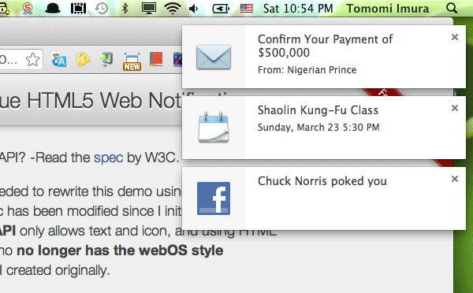
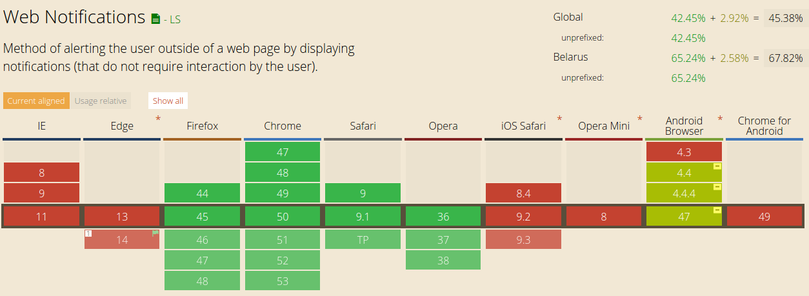
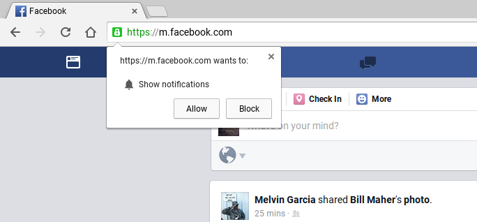
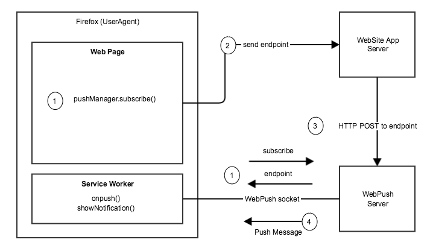
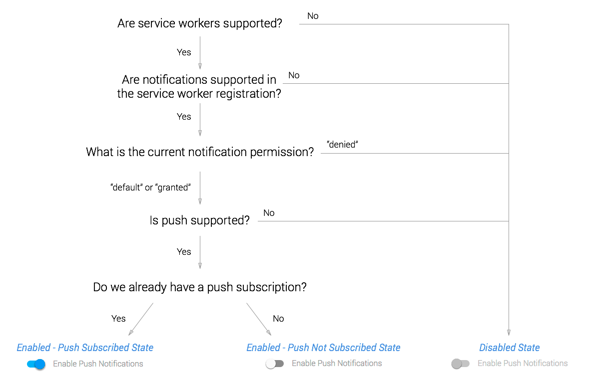
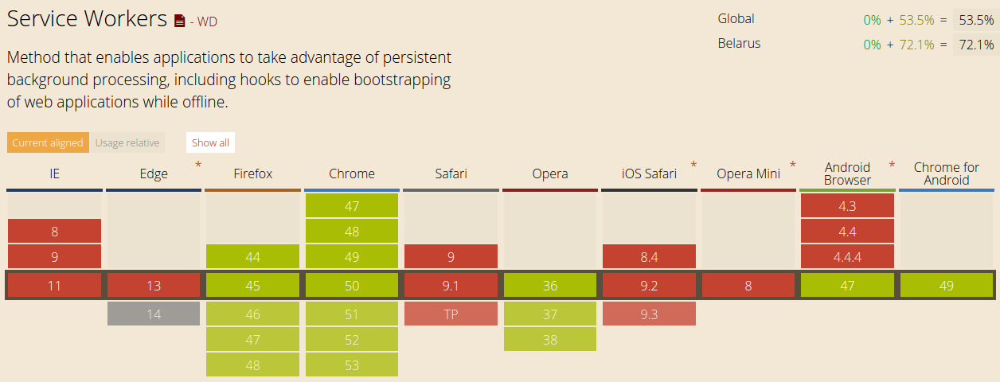
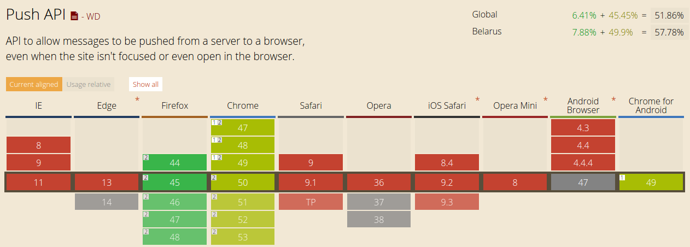

---

layout: default

---

# Яндекс

## **{{ site.presentation.title }}** {#cover}

    
{{ site.presentation.service }}





	
{{ site.author.name }},   {{ site.author.position }}

## Living standard
{:.section}

### Notifications API

## Example

## Step 1. Check caniuse.com

{:.w100}

http://caniuse.com/#feat=notifications

## Step 2. Check user agent support

~~~ javascript
  if (!("Notification" in window)) {
    alert("This browser does not support desktop notification");
  } else {
    // do something great
  }
~~~

## Step 3. Request permissions

~~~ javascript
if (Notification.permission === "granted") {
    // So good 
}
else if (Notification.permission !== 'denied') {
    Notification.requestPermission(function (permission) {
        if (permission === "granted") {
            // So good!
        } else {
            // So bad!
        }
    });
} else {
    // So unexpected
}
~~~

## Step 3. Request permissions

~~~ javascript
Notification.requestPermission().then(function(result) {
  console.log(result); // granted
});
~~~

<button onclick="exampleReq(this)">Request permission</button>

## Step 4. Wait user accept

{:.w100}

## Step 5. Create your first notification

~~~ javascript
var notification = new Notification('Hi there!');
~~~

<button onclick="example1()">Show notification</button>

## Step 6. Configure for great good

~~~ javascript
var notification = new Notification('Hi there!', {
    icon: 'themes/yandex/images/mail.png',
    body: 'Check your mail, men'
});
~~~

<button onclick="example2()">Show notification</button>

## Step 6. Configure events

~~~ javascript
var notification = new Notification('Hi there!', {
    icon: 'themes/yandex/images/mail.png',
    body: 'Check your mail, men'
});

notification.onclick = function() {
    button.textContent = 'Clicked!';
    
    setTimeout(function() {
        notification.close();
    }, 3000);
}
~~~

<button onclick="example3(this)">Show notification</button>

## Step 7. Reduce number of notifications
~~~ javascript
for (var i = 0; i < 5; i++) {
    var notification = new Notification('Title ' + i, {
        icon: 'themes/yandex/images/mail.png',
        body: 'Check your mail, men'
    });  
}
~~~

<button onclick="example4(this)">Show notification</button>

## Step 7. Reduce number of notifications
~~~ javascript
for (var i = 0; i < 5; i++) {
    var notification = new Notification('Title ' + i, {
        tag: 'mail-notify',
        icon: 'themes/yandex/images/mail.png',
        body: 'Check your mail, men'
    });  
}
~~~

<button onclick="example5(this)">Show notification</button>

## Draft
{:.section}

### Service Workers

## Service Workers overview

{:.h400}

## Push API overview

{:.h400}

## Push API overview

{:.h400}

## Step 1. Check caniuse.com

{:.w100}

http://caniuse.com/#feat=serviceworkers

## Step 1. Check caniuse.com

{:.w100}

http://caniuse.com/#feat=push-api

## Step 2. Check user agent support

~~~ javascript
  if ('serviceWorker' in navigator) {
    // do something great
  } else {
    alert('Sorry');
  }
~~~

## Step 3. Create first service worker

~~~ javascript
// sw.js
self.addEventListener('install', function(event) {
    // Perform install steps
});

self.addEventListener('activate', function(event) {
    // Activate
}); 

self.addEventListener('push', function(event) {
  console.log('Push message received', event);
});
~~~

## Step 4. Register Service Worker

~~~ javascript
navigator.serviceWorker.register('/sw.js').then(function(registration) {
    console.log('Successful with scope: ',registration.scope);
}).catch(function(err) {
    console.log('Failed: ', err);
});

// sw.js
console.log('I am alive!');
~~~

<button onclick="swExample1(this)">Request permission</button>

## Step 5. Request API keys

### https://console.cloud.google.com

* Создаете проект
* Активируете Google Cloud Messaging 
* Создаете авторизационные ключи
* Копируете код проекта

## Step 6. Create manifest

~~~ javascript
// manifest.json
{  
  "name": "Push Demo",
  "gcm_sender_id": "351923144723"
}
~~~

~~~ markup
<!-- index.html -->
<link rel="manifest" href="manifest.json">
~~~

## Step 7. Request push persmissions

~~~ javascript
//...
    .then(function(serviceWorkerRegistration) {
        return serviceWorkerRegistration.pushManager.getSubscription()
            .then(function(subscription) {
                if (subscription) {
                    return subscription;
                } else {
                    return serviceWorkerRegistration.pushManager
                        .subscribe({userVisibleOnly: true});
                }
            })
    })
    .then(function(subscription) {  
        console.log(JSON.stringify(subscription));
    });
~~~

## Step 8. Service worker

~~~ javascript
self.addEventListener('push', function(event) {
  event.waitUntil(  
    self.registration.showNotification(title, {  
      body: 'Service Worker message',  
    });
  );  
});
~~~

## Step 9. Magick

<button onclick="swExample2(this)">Magick</button>

